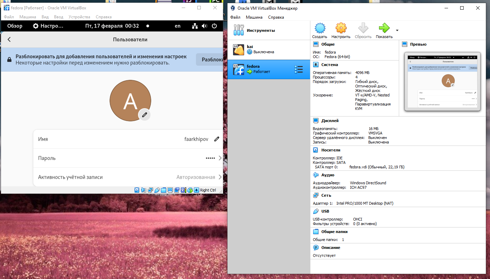

---
## Front matter
title: "отчет по лаборатрной работе №1"
subtitle: "Простейший вариант"
author: "Архипов Фёдор Александрович"

## Generic otions
lang: ru-RU
toc-title: "Содержание"

## Bibliography
bibliography: bib/cite.bib
csl: pandoc/csl/gost-r-7-0-5-2008-numeric.csl

## Pdf output format
toc: true # Table of contents
toc-depth: 2
lof: true # List of figures
lot: true # List of tables
fontsize: 12pt
linestretch: 1.5
papersize: a4
documentclass: scrreprt
## I18n polyglossia
polyglossia-lang:
  name: russian
  options:
	- spelling=modern
	- babelshorthands=true
polyglossia-otherlangs:
  name: english
## I18n babel
babel-lang: russian
babel-otherlangs: english
## Fonts
mainfont: PT Serif
romanfont: PT Serif
sansfont: PT Sans
monofont: PT Mono
mainfontoptions: Ligatures=TeX
romanfontoptions: Ligatures=TeX
sansfontoptions: Ligatures=TeX,Scale=MatchLowercase
monofontoptions: Scale=MatchLowercase,Scale=0.9
## Biblatex
biblatex: true
biblio-style: "gost-numeric"
biblatexoptions:
  - parentracker=true
  - backend=biber
  - hyperref=auto
  - language=auto
  - autolang=other*
  - citestyle=gost-numeric
## Pandoc-crossref LaTeX customization
figureTitle: "Рис."
tableTitle: "Таблица"
listingTitle: "Листинг"
lofTitle: "Список иллюстраций"
lotTitle: "Список таблиц"
lolTitle: "Листинги"
## Misc options
indent: true
header-includes:
  - \usepackage{indentfirst}
  - \usepackage{float} # keep figures where there are in the text
  - \floatplacement{figure}{H} # keep figures where there are in the text
---

# Цель работы

Целью данной работы является приобретение практических навыков установки операционной системы на виртуальную машину, настройки минимально необходимых для дальнейшей работы сервисов.

# Задание

Лабораторная работа подразумевает установку на виртуальную машину VirtualBox (https://www.virtualbox.org/) операционной системы Linux (дистрибутив Fedora).
Выполнение работы возможно как в дисплейном классе факультета физико-математических и естественных наук РУДН, так и дома. Описание выполнения работы приведено для дисплейного класса со следующими характеристиками техники:
Intel Core i3-550 3.2 GHz, 4 GB оперативной памяти, 80 GB свободного места на жёстком диске;
ОС Linux Gentoo (http://www.gentoo.ru/);
VirtualBox версии 7.0 или новее.
Для установки в виртуальную машину используется дистрибутив Linux Fedora (https://getfedora.org), вариант с менеджером окон i3 (https://spins.fedoraproject.org/i3/).
При выполнении лабораторной работы на своей технике вам необходимо скачать необходимый образ операционной системы (https://spins.fedoraproject.org/i3/download/index.html).

# Теоретическое введение

Например, в табл. @tbl:std-dir приведено краткое описание стандартных каталогов Unix.

: Описание некоторых каталогов файловой системы GNU Linux {#tbl:std-dir}

| Имя каталога | Описание каталога                                                                                                          |
|--------------|----------------------------------------------------------------------------------------------------------------------------|
| `/`          | Корневая директория, содержащая всю файловую                                                                               |
| `/bin `      | Основные системные утилиты, необходимые как в однопользовательском режиме, так и при обычной работе всем пользователям     |
| `/etc`       | Общесистемные конфигурационные файлы и файлы конфигурации установленных программ                                           |
| `/home`      | Содержит домашние директории пользователей, которые, в свою очередь, содержат персональные настройки и данные пользователя |
| `/media`     | Точки монтирования для сменных носителей                                                                                   |
| `/root`      | Домашняя директория пользователя  `root`                                                                                   |
| `/tmp`       | Временные файлы                                                                                                            |
| `/usr`       | Вторичная иерархия для данных пользователя                                                                                 |

Более подробно об Unix см. в [@gnu-doc:bash;@newham:2005:bash;@zarrelli:2017:bash;@robbins:2013:bash;@tannenbaum:arch-pc:ru;@tannenbaum:modern-os:ru].

# Выполнение лабораторной работы

в ходе лабораторной работы была установлена и настроена виртуальная машина,создан пользователь и подготовлено и настроено необходимое ПО для работы  
Описываются проведённые действия, в качестве иллюстрации даётся ссылка на иллюстрацию (рис. @fig:001).

{#fig:001 width=70%}

# Ответы на вопросы
Какую информацию содержит учётная запись пользователя?
Имя пользователя, домашний каталог 

Укажите команды терминала и приведите примеры:

для получения справки по команде; -h, --help
для перемещения по файловой системе; cd
для просмотра содержимого каталога;ls
для определения объёма каталога;sudo du -sh
для создания / удаления каталогов / файлов;mkdir,rm_-R,rm
для задания определённых прав на файл / каталог;chmod 
для просмотра истории команд.history 

Что такое файловая система? Приведите примеры с краткой характеристикой.
файловая система это строго структурированный тип хранения данных имеющих различный уровень доступа 
~/ каталог имеющий уровень доступа пользователь 

Как посмотреть, какие файловые системы подмонтированы в ОС
mount

Как удалить зависший процесс?
kill    

# Выводы

В процессе выполнения лабораторной работы была установлена и настроена виртуальная машина с операционной системой Linux дистрибутив Fedora OS

# Список литературы{.unnumbered}

::: {#refs}
:::
