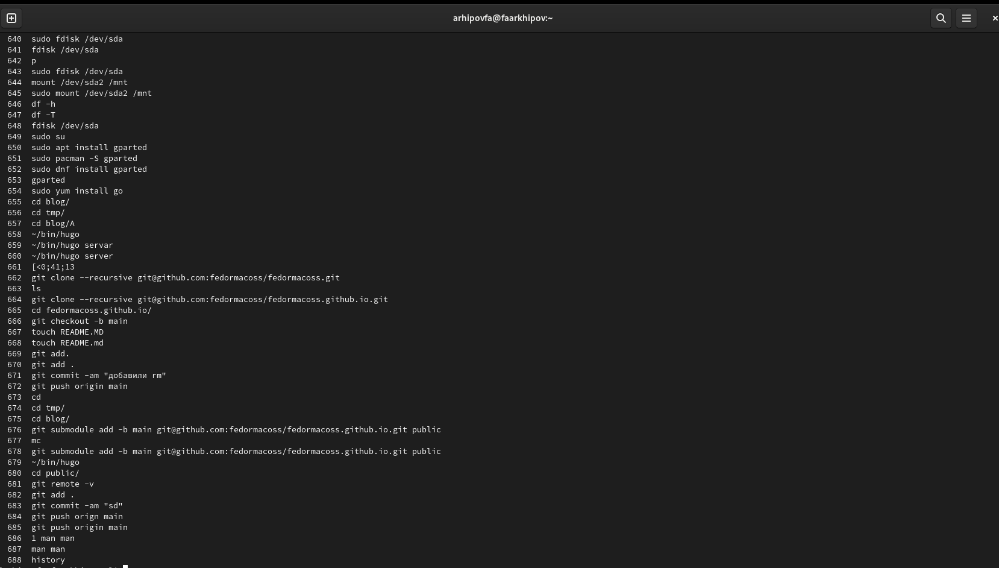

---
## Front matter
lang: ru-RU
title: отчёт по лабораторной работе №4 презентации
author:
  - Архипов Ф А
institute:
  - Российский университет дружбы народов, Москва, Россия

## i18n babel
babel-lang: russian
babel-otherlangs: english

## Formatting pdf
toc: false
toc-title: Содержание
slide_level: 2
aspectratio: 169
section-titles: true
theme: metropolis
header-includes:
 - \metroset{progressbar=frametitle,sectionpage=progressbar,numbering=fraction}
 - '\makeatletter'
 - '\beamer@ignorenonframefalse'
 - '\makeatother'
---

# Информация

## Докладчик

:::::::::::::: {.columns align=center}
::: {.column width="70%"}

  * Архипов Ф А
  * студент
  * Российский университет дружбы народов

:::
::: {.column width="30%"}

:::
::::::::::::::

# Вводная часть

## Объект и предмет исследования

- командная строка

## Цели и задачи

- Приобретение практических навыков взаимодействия пользователя с системой посредством командной строки.

# история
для просмотра истории команда help

{#fig:001 width=70%}

# Команда cd.
Команда cd используется для перемещения по файловой системе операционной системы типа Linux.

# Команда pwd.
Для определения абсолютного пути к текущему каталогу используется
команда pwd (print working directory).

# Команда ls
Команда ls используется для просмотра содержимого каталога.

# Команда mkdir.
Команда mkdir используется для создания каталогов

# Команда rm
Команда rm используется для удаления файлов и/или каталогов.

